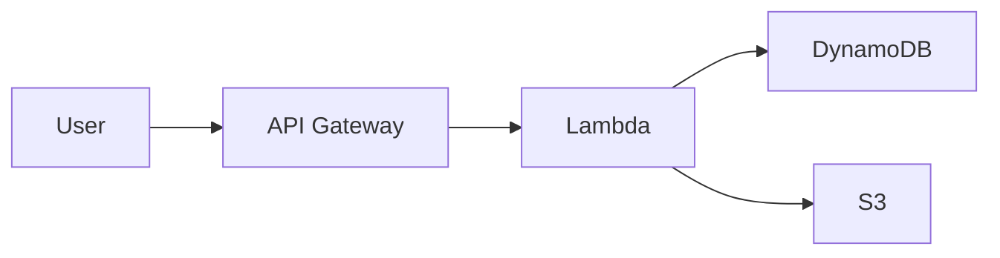

# Content Features

This section demonstrates content features like code, tables, diagrams, and more.

---

# Code Highlighting

Slidev supports beautiful code highlighting:

```typescript
interface User {
  id: number
  name: string
  email: string
}

async function fetchUser(id: number): Promise<User> {
  const response = await fetch(`/api/users/${id}`)
  return response.json()
}
```

Supports many languages with syntax highlighting.

<!--
Code blocks are beautifully styled with syntax highlighting.
-->

---
layout: center
---

# <GradientText color="blue-purple">Center Layout</GradientText>

Perfect for <GradientText color="blue-green">section breaks</GradientText> or <GradientText color="orange-pink">important announcements</GradientText>

Content is centered both horizontally and vertically

Use GradientText component to <GradientText color="blue-purple">emphasize key words</GradientText>

<!--
Center layout puts content in the middle with vertical and horizontal centering.
Great for transitions or key messages. Use GradientText for emphasis.
-->

---

# Tables

Tables are fully supported:

| Feature | AWS Theme | Default Theme |
|---------|-----------|---------------|
| Dark Mode | ✅ | ❌ |
| Gradients | ✅ | ❌ |
| AWS Branding | ✅ | ❌ |
| Code Highlighting | ✅ | ✅ |
| Diagrams | ✅ | ✅ |

<!--
Tables work great for comparisons and data presentation.
-->

---

# Diagrams with Mermaid



Mermaid diagrams are styled with white lines for dark backgrounds.

Use `{scale: 0.8}` to adjust size.

<!--
Mermaid diagrams are automatically styled for the dark theme.
-->

---

# Math Equations

Inline math: $E = mc^2$

Block math:

$$
\frac{d}{dx}\left( \int_{0}^{x} f(u)\,du\right)=f(x)
$$

LaTeX support for mathematical expressions.

<!--
Full LaTeX support for mathematical notation.
-->

---

# Icons

Use Iconify icons easily:

<carbon:arrow-right /> Arrow right

<carbon:checkmark /> Checkmark

Or use emoji: 🚀 ✅ ❌ 💡 📊 🔧

<!--
Icons and emoji for visual elements.
-->

---

# UnoCSS Utilities

Slidev includes UnoCSS for styling:

<div class="grid grid-cols-2 gap-4">
  <div class="bg-blue-500 p-4 rounded">Blue Box</div>
  <div class="bg-green-500 p-4 rounded">Green Box</div>
</div>

<div class="mt-4 text-center text-3xl font-bold">
  Large Centered Text
</div>

<!--
UnoCSS provides utility classes for quick styling.
-->

---
layout: center
---

# Additional Resources

[AWS Documentation](https://aws.amazon.com/documentation/)

[Slidev Documentation](https://sli.dev)

[Theme Repository](#)

<!--
Final slide with links and resources using center layout.
-->
